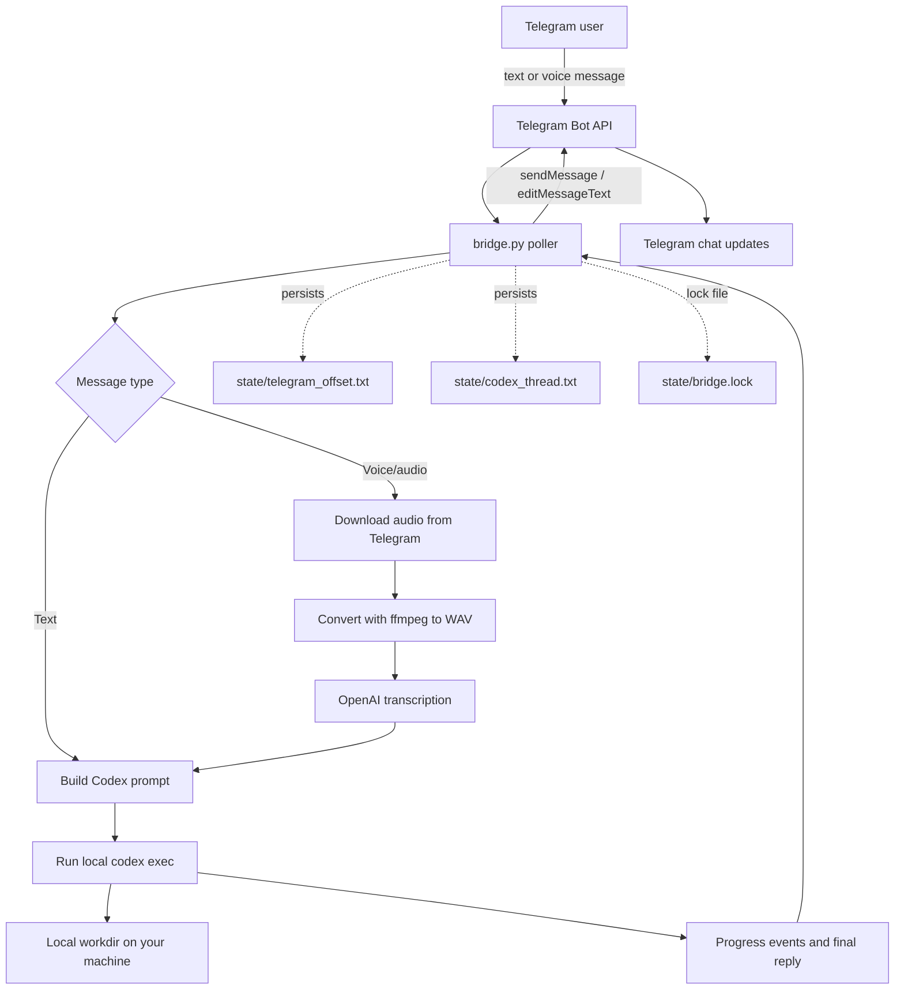

Sometimes I want to say “Codex, do the thing on my machine” while I’m away from my desk, on my phone, in a taxi, or between meetings. That was the whole reason I built [**telegram-codex-bridge**](https://github.com/chunhualiao/telegram-codex-bridge): I wanted Telegram to feel like a lightweight remote control for a **local** Codex CLI session running on a computer I control.

The motivation came directly from **OpenClaw**. I really like the feel of a message app interface where I can just talk to an AI agent naturally, and that led me to a simple question: could I get the same experience for a command-line coding agent like **Codex CLI**?

That question was practical, not hypothetical. I already use Codex CLI to help maintain my **OpenClaw Docker** setup, but I wanted to do that work through **Telegram** instead of being tied to a terminal window, and I wanted **voice messages** to work too.

There was also another reason: when my **OpenClaw** setup runs out of credits or gets rate-limited, this Codex bot on Telegram becomes my **plan B**. I can still talk to my own bot, still reach my own machine, and still get things done without waiting around for the primary setup to recover.

So I opened up **Codex with GPT-5.4** and vibe-coded this tool in **less than two hours**.

---

## **What [telegram-codex-bridge](https://github.com/chunhualiao/telegram-codex-bridge) is (and what it isn’t)**

At its core, this is a small Python “bridge” that **polls Telegram messages**, forwards them into **local `codex exec`**, and relays both **progress** and the **final reply** back into Telegram. I built it for a **single authorized user** talking to **one local Codex environment**, not as a hosted multi-user service.

I also added support for **Telegram voice/audio messages** by downloading the audio, converting it with **ffmpeg**, and transcribing it via OpenAI before sending the transcript into Codex. That part mattered to me because voice is often the most natural interface when I’m away from my desk.

---

## **A quick look at the repo (screenshot)**

*Repository preview for [telegram-codex-bridge](https://github.com/chunhualiao/telegram-codex-bridge).*

---

## **Why this bridge feels “nice” in practice**

A few design choices made this feel much nicer than a trivial “Telegram bot calls a command” script:

I made it persist a **Codex thread ID**, so follow-up messages stay in the same conversation until I reset it. I also made it edit a “Running Codex…” status message to provide **live-ish progress updates** while Codex runs, which turns out to be really nice on mobile when I don’t want to sit there wondering whether anything is happening. 

---

## **How it works (architecture, simplified)**

Under the hood, I store operational state on disk, things like the Telegram update offset and the Codex thread ID, so the bridge can run continuously without replaying old messages and can pick the conversation back up cleanly.

---

## **Setup overview (what you’ll actually do)**

The setup flow I recommend is very pragmatic:

First, verify the basics: Python 3, `codex` installed and logged in, and outbound network access. Then create a Telegram bot via BotFather, send it a test message so Telegram exposes a `chat.id`, fill out `.env` from `.env.example`, and **run `python3 bridge.py` in the foreground first** before attempting background or LaunchAgent setups.

The `.env.example` is straightforward: Telegram credentials, allowlist IDs, a passphrase, Codex runtime knobs, and optional OpenAI transcription settings for voice. 

---

## **What you can do from Telegram once it’s running**

I kept the command set intentionally small:

`/start` returns a readiness message, `/status` tells you whether there’s a saved Codex thread and which workdir is configured, and `/reset` clears the saved thread so the next prompt starts fresh.

Everything else is treated as a normal prompt and forwarded into Codex, so I can ask things like “review this repo,” “run tests,” or “create a script,” assuming my local Codex is allowed to do that and my `CODEX_FLAGS` support the workflow I want. That simplicity was part of the point.

---

## **Voice notes: the underrated feature**

If I send a Telegram voice message, the bridge will:

Download it, convert it to WAV via **ffmpeg**, call OpenAI transcription, then feed the transcript to Codex as my prompt. I ended up liking this feature more than I expected, because it makes the whole thing feel much closer to a real messaging interface instead of a remote shell with extra steps. The default transcription prompt is also written to preserve technical terms, commands, and file paths, which matters a lot for this use case. 

---

## **Security model: simple on purpose, but you should read this**

This repo is powerful enough to be dangerous if I run it casually, because it can trigger a local coding agent with real access to my filesystem and tools.

The safety model is simple:

It only accepts messages from one allowed Telegram chat or user, keeps the bot token in `.env`, and includes an inactivity lock that forces the configured passphrase after a timeout. It also explicitly warns that `--full-auto` reduces approval friction and is not appropriate for untrusted environments, so I think about this as remote control for my own machine, not a shared bot.

If the bot token leaks, someone can interact with the bot via the Telegram API until it is rotated, so I treat `.env` like a password vault entry.

---

## **Operational tips you’ll appreciate later**

Two details have already saved me real time:

I use a PID lock file (`state/bridge.lock`) to avoid multiple pollers, because Telegram can respond with **409 Conflict** if more than one process polls `getUpdates`. I also recommend foreground runs first so I can debug real network and CLI issues before adding background or `launchd` complexity. It is one of those cases where the boring operational details matter more than the flashy part.

---

## **License**

I released the repository under the **MIT License**.